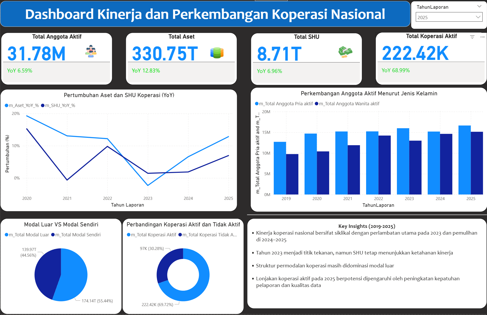

# Analisis Data Koperasi Nasional (2019–2025)

## Gambaran Umum
Repository ini berisi portfolio analisis data koperasi skala nasional yang dikembangkan untuk mendukung monitoring kinerja koperasi dan pengambilan keputusan berbasis data.

Analisis dilakukan menggunakan data historis periode 2019–2025 dengan fokus pada tren pertumbuhan, perbandingan wilayah, serta evaluasi indikator utama koperasi.

Project ini merepresentasikan praktik kerja analisis data nyata, mulai dari pembersihan data, agregasi, hingga penyajian insight dalam bentuk dashboard interaktif menggunakan Power BI.

> ⚠️ **Catatan Privasi Data**  
> Seluruh data yang digunakan dalam repository ini telah dianonimkan dan/atau disajikan dalam bentuk agregat.  
> Project ini dibuat semata-mata untuk menunjukkan metode dan kemampuan analisis data, tanpa menampilkan data rahasia atau sensitif.

---

## Struktur Dashboard
Project ini terdiri dari **3 dashboard utama** yang dirancang untuk kebutuhan analisis yang berbeda:

1. **Dashboard Nasional**  
   Menyajikan ringkasan indikator utama koperasi secara nasional untuk monitoring tren jangka panjang.

2. **Dashboard Perbandingan Wilayah**  
   Digunakan untuk membandingkan kinerja koperasi antar provinsi sebagai tahap *screening* awal wilayah prioritas.

3. **Dashboard Analisis Perbandingan 2024–2025**  
   Difokuskan pada identifikasi anomali pertumbuhan sebagai alat bantu validasi data dan evaluasi lanjutan.

Detail masing-masing dashboard dijelaskan pada dokumentasi
di folder `powerbi/`.

---

## Dashboard Overview

---

## Tujuan Analisis
- Menganalisis tren pertumbuhan koperasi dari tahun ke tahun
- Membandingkan kinerja koperasi secara nasional dan antar wilayah
- Menyediakan dasar analisis untuk kebutuhan pelaporan dan evaluasi data

---

## Ruang Lingkup Project
- Periode data: 2019–2025  
- Level analisis: Nasional dan provinsi (versi agregat)  
- Indikator utama:
  - Jumlah koperasi aktif
  - Jumlah anggota
  - Aset
  - Selisih Hasil Usaha (SHU)
  - Modal
  - Volume Usaha Koperasi

---

## Tools & Teknologi
- **SQL** – Validasi data, filtering, dan agregasi  
- **Power BI** – Data modeling, DAX, dan visualisasi dashboard  
- **Microsoft Excel** – Pelaporan terstruktur dan pemenuhan permintaan data  

---

## Struktur Repository
- `sql/` → Query SQL untuk persiapan dan agregasi data  
- `powerbi/` → Dokumentasi dan screenshot dashboard Power BI  
- `dax/` → Penjelasan perhitungan indikator menggunakan DAX  
